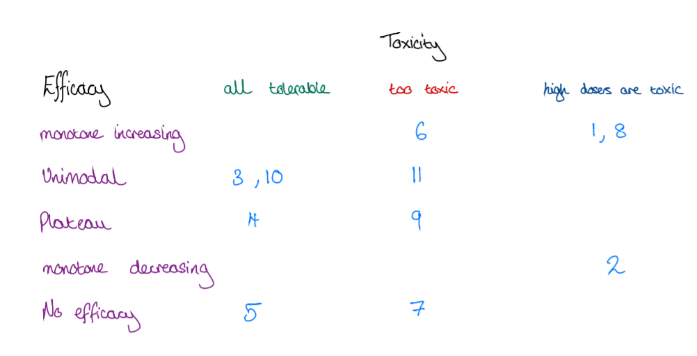
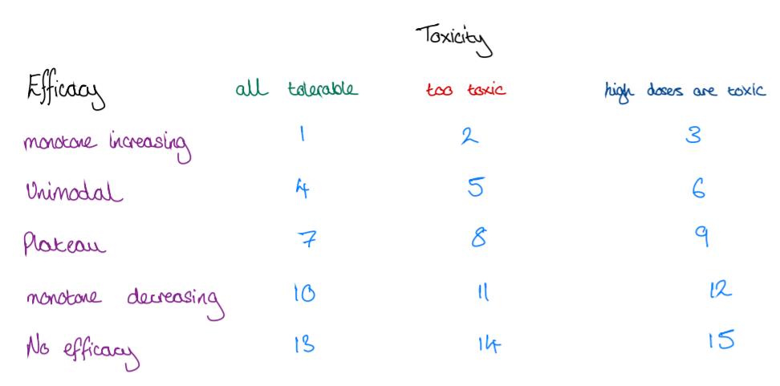

```{r setup, include=FALSE}
library(ggplot2)
library(dplyr)
library(tidyr)
```

```{r, echo =FALSE }
dose <- rep(c('1', '2', '3', '4', '5'), times = 12)
scenario <- rep(c('Scenario 1', 'Scenario 2', 'Scenario 3', 'Scenario 4',
                  'Scenario 5', 'Scenario 6', 'Scenario 7', 'Scenario 8',
                  'Scenario 9', 'Scenario 10', 'Scenario 11', 'Scenario 12'),
                each = 5)
ptox <- c(0.1, 0.2, 0.3, 0.35, 0.45, #1
          0.1, 0.2, 0.3, 0.35, 0.45, #2
          0.1, 0.2, 0.25, 0.3, 0.35, #3
          0.1, 0.2, 0.25, 0.3, 0.35, #4
          0.1, 0.2, 0.25, 0.3, 0.35, #5
          0.1, 0.4, 0.45, 0.5, 0.55, #6
          0.1, 0.4, 0.45, 0.5, 0.55, #7
          0.1, 0.25, 0.35, 0.45, 0.55, #8
          0.1, 0.4, 0.45, 0.5, 0.55, #9
          0.1, 0.2, 0.25, 0.3, 0.35, #10
          0.1, 0.4, 0.45, 0.5, 0.55, #11
          0.1, 0.2, 0.25, 0.3, 0.35 #12
          )
peff <- c(0.3, 0.4, 0.5, 0.6, 0.7, #1
          0.3, 0.7, 0.6, 0.5, 0.4, #2
          0.3, 0.4, 0.5, 0.6, 0.5, #3
          0.3, 0.4, 0.6, 0.6, 0.6, #4
          0.3, 0.3, 0.3, 0.3, 0.3, #5
          0.3, 0.5, 0.6, 0.7, 0.8, #6
          0.3, 0.3, 0.3, 0.3, 0.3, #7
          0.3, 0.4, 0.5, 0.6, 0.7, #8
          0.3, 0.4, 0.6, 0.6, 0.6, #9
          0.3, 0.4, 0.7, 0.5, 0.4, #10
          0.3, 0.4, 0.7, 0.5, 0.4, #11
          0.3, 0.3, 0.3, 0.4, 0.7 #12
          )
data <- data.frame(scenario, dose, ptox, peff) %>% 
  pivot_longer(cols = c(ptox, peff)) %>% 
  mutate(scenario = factor(scenario, 
                           levels = c('Scenario 1', 'Scenario 2', 'Scenario 3',
                                      'Scenario 4','Scenario 5', 'Scenario 6',
                                      'Scenario 7', 'Scenario 8','Scenario 9',
                                      'Scenario 10', 'Scenario 11', 
                                      'Scenario 12')))
```


# Plots of scenarios

We assume the probability of efficacy and toxicity at dose level 1 (i.e the control dose) is 30% and 10% for all scenarios. We set the target efficacy rate at 50% (red line) and target toxicity rate at 35% (blue line). Below is a plot of potential scenarios. I give a brief explanation of each one below. 

```{r, echo = FALSE}
data %>% 
ggplot(aes(x  = dose, y = value, group = name))+
  geom_point(aes(col = name))+
  geom_line(aes(col = name)) +
  geom_hline(aes(yintercept = 0.35, linetype = 'Tox'), col = 'blue')+
  geom_hline(aes(yintercept = 0.5, linetype = 'Eff'), col = 'red')+
  facet_wrap(.~ scenario)+
  scale_linetype_manual(name = "Target", values = c(2, 2), 
                        guide = guide_legend(override.aes = 
                                               list(color = c("red",
                                                              "blue"))))+
  labs(x = 'Dose', y = 'Probability')
```


## Summary of Scenarios
* Scenario 1 - Monotone increasing in efficacy and toxicity. OBD would be dose 4. 
* Scenario 2 - Unimodal, low doses more efficacious. OBD would be dose 2. 
* Scenario 3 - Unimodal, efficacy initially increases then falls off. OBD would be dose 4. 
* Scenario 4 - Plateau, no increase in efficacy after dose 3. OBD would be dose 3. 
* Scenario 5 - Drug is ineffective. No OBD recommend stopping / dose 1. 
* Scenario 6 - Monotone increasing in efficacy and toxicity but the drug is too toxic. No OBD recommend stopping / dose 1. 
* Scenario 7 - Drug is ineffective and too toxic. No OBD recommend stopping / dose 1. 
* Scenario 8 - Monotone increasing in eff and tox with higher doses being too toxic. OBD would be dose 3. 
* Scenario 9 - Plateau, but too toxic. No OBD recommend stopping / dose 1. 
* Scenario 10 - Unimodal, efficacy peaks at middle dose. OBD would be dose 3. 
* Scenario 11 - Unimodal, efficacy peaks at middle dose but drug is too toxic. No OBD recommend stopping / dose 1. 
* Scenario 12 - Efficacy only occurs at higher doses. OBD would dose 5. 



Here scenarios that fall under the 'all tolerable' column can be thought of as the good scenarios where a number of doses can be selected. The 'too toxic' column are the disaster scenarios where no dose is good. Finally, the 'high dose are toxic' column are the compromised scenarios where only one or two doses could be considered good. (Note: I'm not sure where scenario 12 would fit on this table)

# New suggested scenarios 
Based on the table above I look at 5 different efficacy curves and 3 different toxicity curves. I propose 1 scenario for each combination, which gives the 15 scenarios below. 
```{r, echo =FALSE }
dose <- rep(c('1', '2', '3', '4', '5'), times = 15)
scenario <- rep(c('Scenario 1', 'Scenario 2', 'Scenario 3', 'Scenario 4',
                  'Scenario 5', 'Scenario 6', 'Scenario 7', 'Scenario 8',
                  'Scenario 9', 'Scenario 10', 'Scenario 11', 'Scenario 12',
                  'Scenario 13', 'Scenario 14', 'Scenario 15' ),
                each = 5)
ptox <- c(0.1, 0.2, 0.25, 0.3, 0.35, #1
          0.1, 0.4, 0.45, 0.5, 0.55, #2
          0.1, 0.25, 0.35, 0.45, 0.55, #3
          0.1, 0.2, 0.25, 0.3, 0.35, #4
          0.1, 0.4, 0.45, 0.5, 0.55, #5
          0.1, 0.25, 0.35, 0.45, 0.55, #6
          0.1, 0.2, 0.25, 0.3, 0.35, #7
          0.1, 0.4, 0.45, 0.5, 0.55, #8
          0.1, 0.25, 0.35, 0.45, 0.55, #9
          0.1, 0.2, 0.25, 0.3, 0.35, #10
          0.1, 0.4, 0.45, 0.5, 0.55, #11
          0.1, 0.25, 0.35, 0.45, 0.55, #12
          0.1, 0.2, 0.25, 0.3, 0.35, #13
          0.1, 0.4, 0.45, 0.5, 0.55, #14
          0.1, 0.25, 0.35, 0.45, 0.55 #15
          )
peff <- c(0.3, 0.4, 0.5, 0.6, 0.7, #1
          0.3, 0.4, 0.5, 0.6, 0.7, #2
          0.3, 0.4, 0.5, 0.6, 0.7, #3
          0.3, 0.4, 0.7, 0.5, 0.4, #4
          0.3, 0.4, 0.7, 0.5, 0.4, #5
          0.3, 0.4, 0.7, 0.5, 0.4, #6
          0.3, 0.4, 0.6, 0.6, 0.6, #7
          0.3, 0.4, 0.6, 0.6, 0.6, #8
          0.3, 0.4, 0.6, 0.6, 0.6, #9
          0.3, 0.7, 0.6, 0.5, 0.4, #10
          0.3, 0.7, 0.6, 0.5, 0.4, #11
          0.3, 0.7, 0.6, 0.5, 0.4, #12
          0.3, 0.3, 0.3, 0.3, 0.3, #13
          0.3, 0.3, 0.3, 0.3, 0.3, #14
          0.3, 0.3, 0.3, 0.3, 0.3 #15
          )
data <- data.frame(scenario, dose, ptox, peff) %>% 
  pivot_longer(cols = c(ptox, peff)) %>% 
  mutate(scenario = factor(scenario, 
                           levels = c('Scenario 1', 'Scenario 2', 'Scenario 3',
                                      'Scenario 4','Scenario 5', 'Scenario 6',
                                      'Scenario 7', 'Scenario 8','Scenario 9',
                                      'Scenario 10', 'Scenario 11',
                                      'Scenario 12', 'Scenario 13',
                                      'Scenario 14', 'Scenario 15')))
```

```{r, echo=FALSE}
data %>% 
  filter(scenario == 'Scenario 1' | scenario == 'Scenario 2'|
         scenario == 'Scenario 3' | scenario == 'Scenario 4' | 
         scenario == 'Scenario 5' | scenario == 'Scenario 6' ) %>% 
ggplot(aes(x  = dose, y = value, group = name))+
  geom_point(aes(col = name))+
  geom_line(aes(col = name)) +
  geom_hline(aes(yintercept = 0.35, linetype = 'Tox'), col = 'blue')+
  geom_hline(aes(yintercept = 0.5, linetype = 'Eff'), col = 'red')+
  facet_wrap(.~ scenario, ncol =3)+
  scale_linetype_manual(name = "Target", values = c(2, 2),
                        guide = guide_legend(override.aes =
                                               list(color = c("red",
                                                              "blue"))))+
  labs(x = 'Dose', y = 'Probability')
```

```{r, echo=FALSE}
data %>% 
  filter(scenario == 'Scenario 7' | scenario == 'Scenario 8'|
         scenario == 'Scenario 9' | scenario == 'Scenario 10' | 
         scenario == 'Scenario 11' | scenario == 'Scenario 12' ) %>% 
ggplot(aes(x  = dose, y = value, group = name))+
  geom_point(aes(col = name))+
  geom_line(aes(col = name)) +
  geom_hline(aes(yintercept = 0.35, linetype = 'Tox'), col = 'blue')+
  geom_hline(aes(yintercept = 0.5, linetype = 'Eff'), col = 'red')+
  facet_wrap(.~ scenario, ncol =3)+
  scale_linetype_manual(name = "Target", values = c(2, 2),
                        guide = guide_legend(override.aes =
                                               list(color = c("red",
                                                              "blue"))))+
  labs(x = 'Dose', y = 'Probability')
```

```{r, echo=FALSE, fig.height= 2.5}
data %>% 
  filter(scenario == 'Scenario 13' | scenario == 'Scenario 14'|
         scenario == 'Scenario 15'  ) %>% 
ggplot(aes(x  = dose, y = value, group = name))+
  geom_point(aes(col = name))+
  geom_line(aes(col = name)) +
  geom_hline(aes(yintercept = 0.35, linetype = 'Tox'), col = 'blue')+
  geom_hline(aes(yintercept = 0.5, linetype = 'Eff'), col = 'red')+
  facet_wrap(.~ scenario, ncol =3, nrow =2)+
  scale_linetype_manual(name = "Target", values = c(2, 2),
                        guide = guide_legend(override.aes =
                                               list(color = c("red",
                                                              "blue"))))+
  labs(x = 'Dose', y = 'Probability')
```

# Summary of new scenarios 
We add 3 more scenarios but we get to look at each efficacy relationship under the different toxicity relationships. One possible criticism is that we don't look at different efficacy curves in each relationship. For example the plateau could occur at a different dose or for the unimodal relationship another dose could be the peak.  


